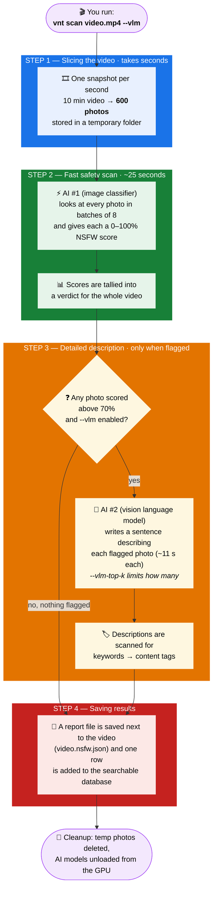

# video-nsfw-tagger

A local, offline, privacy-first CLI for NSFW video analysis.

`vnt scan <path>` samples frames with `ffmpeg`, scores each frame with the
[Falconsai NSFW ViT (2026 Edition)](https://huggingface.co/Falconsai/nsfw_image_detection_26),
and writes a JSON sidecar plus a per-directory SQLite index.

> **Note:** The 2026 ViT model is gated on Hugging Face. `vnt` automatically
> reads an `HF_TOKEN` from the environment or from
> `~/.config/insanely-fast-whisper-rocm/.env` (if present). You must accept
> the model's gate terms on its HF page before the first download.

Phase A ships the ViT pipeline. Phase B (VLM captioning via Ollama) is
validated on the AMD RX 6600 / ROCm server — see
[docs/rocm-validation.md](docs/rocm-validation.md) for environment details.

## Quick start (ROCm target)

```bash
# Create venv with ROCm torch
python3.12 -m venv .venv
source .venv/bin/activate
pip install --upgrade pip setuptools wheel
pip install torch torchvision --index-url https://download.pytorch.org/whl/rocm6.4
pip install -e ".[dev]"

# gfx1032 (RX 6600) workaround — required before every run
export HSA_OVERRIDE_GFX_VERSION=10.3.0

vnt config-show

# Synthetic end-to-end smoke test
ffmpeg -f lavfi -i testsrc=duration=5:size=320x240:rate=30 -pix_fmt yuv420p -y /tmp/vnt-sample.mp4
vnt scan /tmp/vnt-sample.mp4
cat /tmp/vnt-sample.nsfw.json
vnt report
```

## Usage

```bash
vnt scan <file|dir> [--recursive] [--threshold 0.7] [--fps 1]
         [--max-duration N] [--db PATH] [--device auto|cpu|cuda|mps]
         [--vlm|--ollama] [--vlm-model|--ollama-model MODEL]
         [--vlm-top-k N] [--lexicon PATH] [--unload-vit-before-vlm]
         [--vlm-prompt TEXT] [--vlm-prompt-file PATH] [--vlm-prompt-id ID]
         [--frame-cache DIR] [--vlm-think|--no-vlm-think] [--vlm-retries N]
         [--keep-vlm-loaded]
vnt report [--db PATH] [--verdict nsfw] [--min-percent 10]
vnt prompt-report <run_dir> [--lexicon PATH]
vnt config-show
```

`--vlm` captions frames above the NSFW threshold with a local VLM served by
Ollama (default
`hf.co/mradermacher/Huihui-Qwen3-VL-4B-Thinking-abliterated-GGUF:Q4_K_M`, an
abliterated Qwen3-VL 4B; `--vlm-model` accepts any pulled Ollama model name). The scan fails fast if Ollama is unreachable or the model isn't pulled.
Captions are matched against a keyword lexicon (`--lexicon`, default
`lexicon/acts.yaml`) to derive act tags.

### Prompt experiments

See [docs/prompt-experiments.md](docs/prompt-experiments.md) for the full
guide to testing and selecting prompts.

`--frame-cache DIR` caches extracted frames and ViT scores so repeated VLM
runs (e.g. prompt sweeps) only rerun captioning. Pass `--vlm-prompt-file` or
`--vlm-prompt` to override the default prompt; use `--vlm-prompt-id` to label
the run in the sidecar. Then run the comparison report:

```bash
# Run 10 prompts against one sample
scripts/10-prompt-test.sh watch/sample.mp4 --top-k 10

# Manually
echo "Describe this image." > prompt.txt
vnt scan sample.mp4 --vlm --vlm-prompt-file prompt.txt \
  --vlm-prompt-id my_prompt --frame-cache .vnt_cache
vnt prompt-report experiments/results/<timestamp>
```

## How a scan works

Think of it as an assembly line: the video is sliced into photos, a fast
AI looks at every photo, and only the suspicious ones are sent to a
second, smarter (but much slower) AI for a written description.

Example: a 10-minute video at default settings.



**How long does it take?** That depends on what the fast AI finds, not
on how long the video is:

| What the video contains | Time for 10 minutes of footage |
| --- | --- |
| Nothing flagged | ~30 seconds |
| A few flagged moments | + ~11 s per flagged photo |
| Almost everything flagged | capped by `--vlm-top-k` (e.g. `--vlm-top-k 10` adds ~2 min) |

Everything runs locally on your machine — no frames or results ever
leave it.

## Development

```bash
source .venv/bin/activate
pytest -q          # unit tests (no model downloads)
ruff check .       # lint
ruff format .      # format
```

## Privacy note

All processing is local. Models are downloaded from Hugging Face on first use and
cached under `~/.cache/huggingface`; after the first run the tool can operate
offline with `HF_HUB_OFFLINE=1`.
